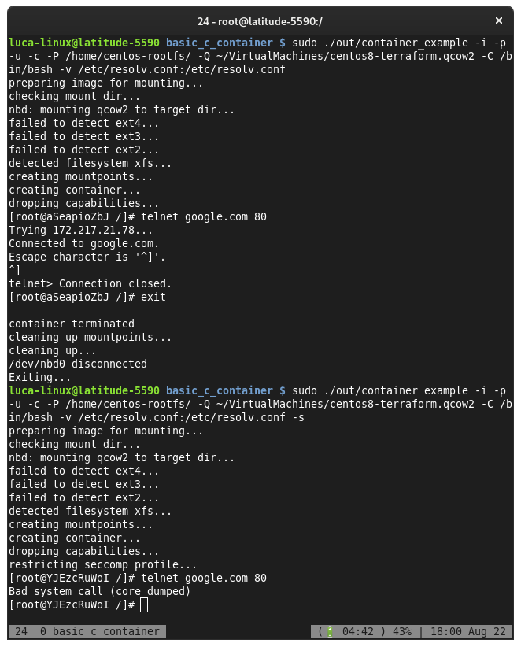

# Simple linux container implementation in C

This is inspired by the Gontainer project by alegrey91, available here:


DISCLAIMER: **this project is for fun and learning**


[Gontainer](https://github.com/alegrey91/Gontainer)

## To start

Download a rootfs that we will use for our container, this will be based on Alpine,
download it:

`http://dl-cdn.alpinelinux.org/alpine/v3.12/releases/x86_64/alpine-minirootfs-3.12.0-x86_64.tar.gz`

then unpack it in /home

```
sudo mkdir /home/alpine-minirootfs-3.12.0-x86_64; 
sudo chown 1000.1000 /home/alpine-minirootfs-3.12.0-x86_64
tar xfv alpine-minirootfs-3.12.0-x86_64.tar.gz -C /home/alpine-minirootfs-3.12.0-x86_64
```

### Dependency

This project depends on libcap-dev

`yum install libcap-devel libseccomp-devel` 

or

`apt install libcap-dev libseccomp-dev`

or

`zypper install libcap-devel libseccomp-devel`

### Compiling

`make clean`

### Executing

`sudo ./out/container_example -i -m -p -u -c -P /home/alpine-minirootfs-3.12.0-x86_64/ -C /bin/sh`


### Example with command line arguments

```
Usage: container_example [OPTION]...
 [-Q/--qcow2 path-to-qcow2-image (optional)]
 [-P/--path path-to-mountpoint]
 [-C/--command command-to-execute] [-h/--help]
 [-i/--ipc reate the process in a new IPC namespace]
 [-n/--net isolate network devices from host ]
 [-m/--mounts isolate mountpoints namespace]
 [-p/--pid create the process in a new PID namespace]
 [-u/--uts isolate hostname]
 [-c/--cgroup Create the process in a new cgroup ]
 [-U/--user create the process in a new USER namespace ]
 [-v/--volume mount_host:mount_container ]
 [-s/--seccomp-enable restrict enabled syscalls to th minimum ]
 [-S/--seccomp-whitelist comma separated list of syscall numbers to allow ]

```

if you want to use qcow2 images as base for rootfs, you can use the `-Q` flag to point to the .qcow2 file,
example of centos8 container starting from a working VM:

`sudo ./out/container_example -i -m -p -u -c -P /home/centos-rootfs/ -Q ~/VirtualMachines/centos8-terraform.qcow2 -C /bin/bash -v /home/luca-linux:/home`

The following namespace isolation flags are passed to create the container:

   *  `-i`  `CLONE_NEWIPC`    = create the process in a new IPC namespace
   *  `-n`  `CLONE_NEWNET`    = isolate network devices from host
   *  `-m`  `CLONE_NEWNS `    = isolate mountpoints namespace
   *  `-p`  `CLONE_NEWPID`    = create the process in a new PID namespace
   *  `-U`  `CLONE_NEWUSER`   = executed in a new user namespace, isolate users
   *  `-u`  `CLONE_NEWUTS`    = isolate hostname
   *  `-c`  `CLONE_NEWCGROUP` = Create the process in a new cgroup namespace


this will create a centos8 container, and share the '/home/linux' folder with it.


---

Also capabilities are dropped in the container, root does not have full admin capabilities:


## Goint Rootless

Creating a container without root is possible, specifying the `-U` flag to create a new
**user namespace**, this will map the current user to the corresponding root of the container.

this is **NOT** compatible with:

- mounting options (needs root)
- using qcow2 images (needs root)

command:

`./out/container_example -i -m -p -u -c -P /home/alpine-minirootfs-3.12.0-x86_64/ -C /bin/sh -U`


## Excluding Syscalls

It is possible to also harden the container disabling some syscalls, using `seccomp`.
For now, it is a static set of whitelisted syscalls that are necessary for the container
to function properly, but it may be possible in future to create some sort of profile file per-container.

As it's possible to see here, after hardening the container (`-s` or `--seccomp-enable` flag)



non-vital syscalls are blocked now.

**Whitelisting syscalls**

Maybe this mode is too strict for your software to run, so we want to whitelist the syscalls we need.

Using the `-S` or `--seccomp-whitelist` flag, we provide a list of **syscall numbers** to whitelist.

For example, if we add to the previous example:

`sudo ./out/container_example -i -m -p -u -c -P /home/centos-rootfs/ -Q ~/VirtualMachines/centos8-terraform.qcow2 -C /bin/bash -v /etc/resolv.conf:/etc/resolv.conf --seccomp-enable --seccomp-whitelist 49,51,47,44,54,307,45,55,271,48`


Now telnet will work, but still blocking non-needed syscalls needed from other software (like curl in the pic).

## References

1. https://medium.com/@teddyking/linux-namespaces-850489d3ccf
3. http://ifeanyi.co/posts/linux-namespaces-part-1/
4. https://klotzandrew.com/blog/container-from-scratch
6. https://en.wikipedia.org/wiki/Linux_namespaces

### Wishlist

In future it would be fun to implement:

- [x] complete cli interface much like `gontainer` does
- [x] support for capabilities+secutebits to create unprivileged containers
- [x] rootless containers
- [x] mountpoints support docker style `-v a:b -v c:d`
- [x] add seccomp support, block some syscalls to test
- [x] qcow2 support, to use an existing VM as a template/rootfs for the container, much like `systemd-nspanw` does
- [ ] img/iso support to use existing VM as template/rootfs for the container
- [ ] directly use docker images as template/rootfs for the container
- [ ] lxc-like boot to have a full system instead of a single process
- [ ] pass namespaced network interface (bridge?) to have a separate network (right now, isolating network results in missing connectivity)
- [ ] add cgroups support, in this demo we will just use CPU, Memory and PIDs
